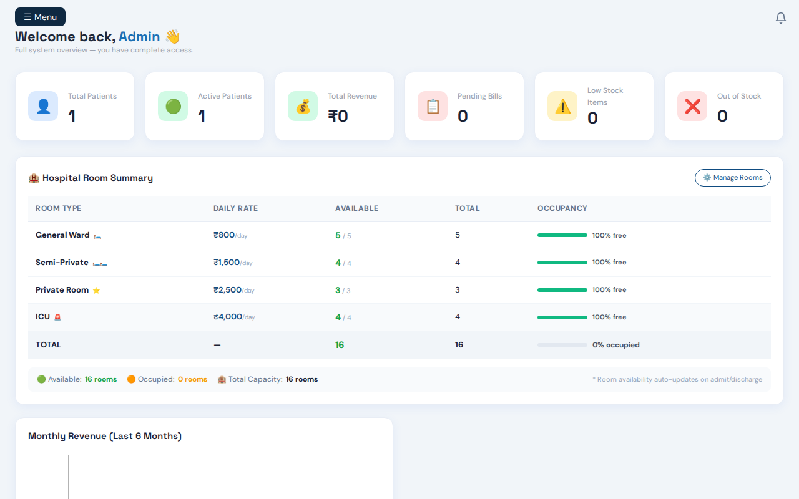
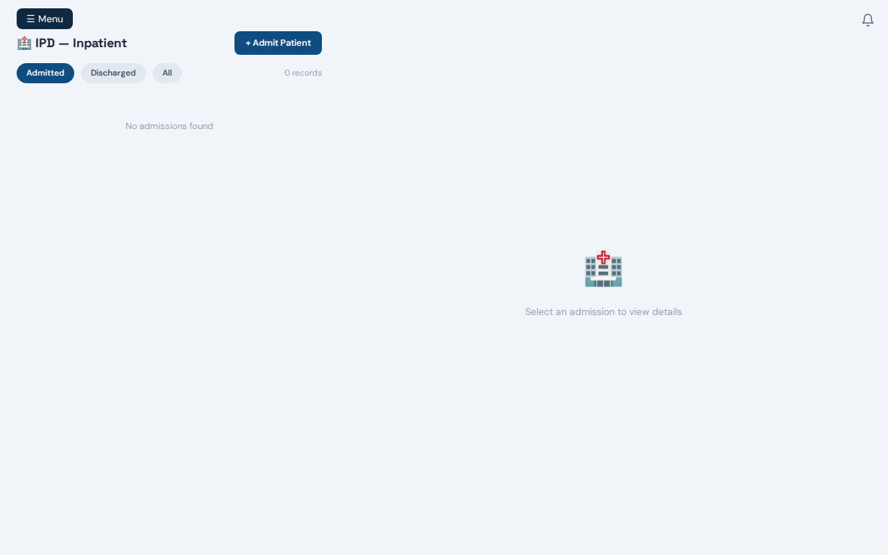
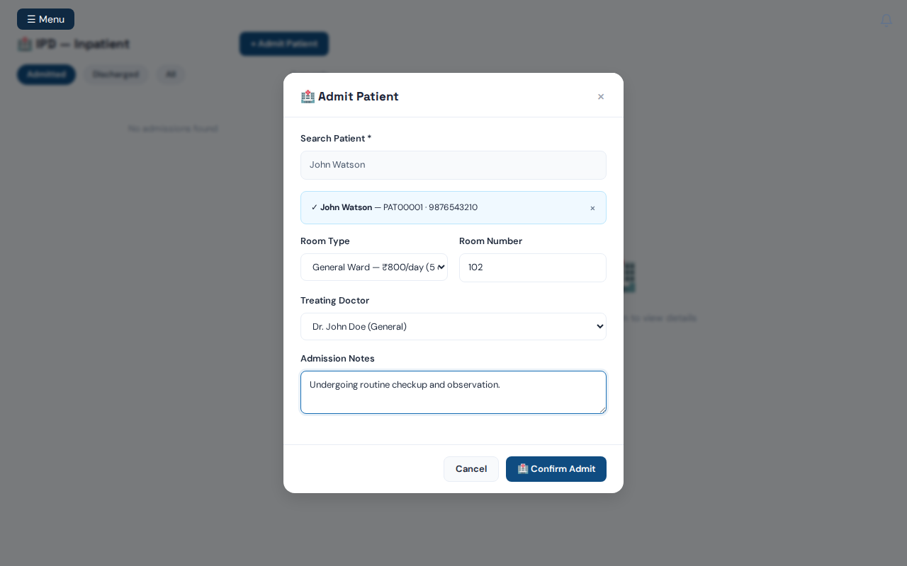
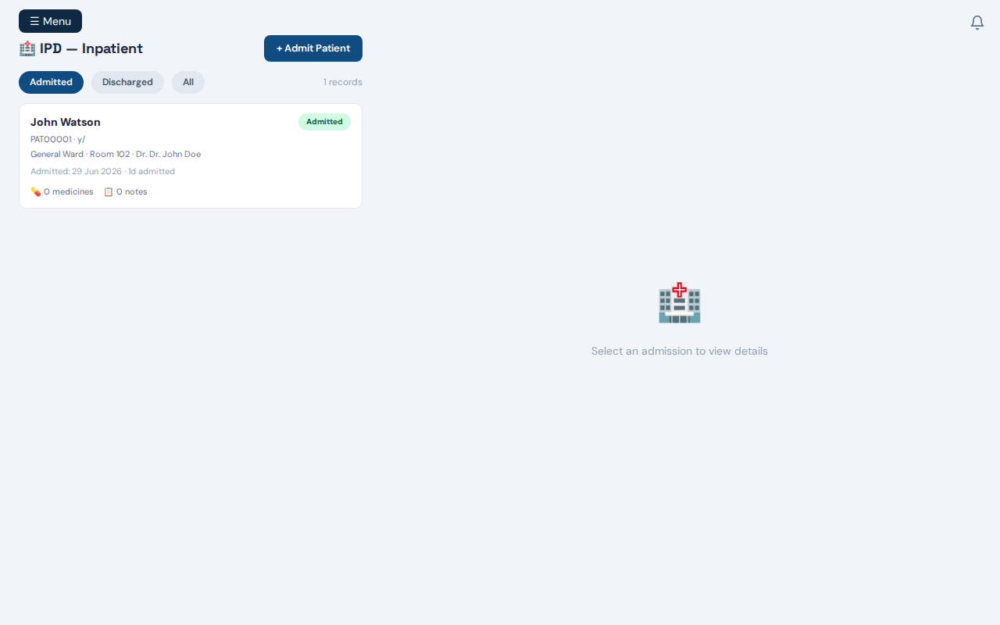
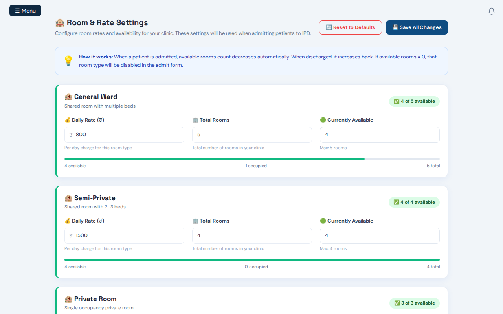

# 🏨 Room Allocation and Availability Verification

This folder contains the verification screenshots captured during the automated tests of the IPD patient admission and room allocation flow.

We have verified that admitting a patient correctly decrements the `availableRooms` count of the selected room type (ward) in the database and updates the UI dynamically.

````carousel

<!-- slide -->

<!-- slide -->

<!-- slide -->

<!-- slide -->

````

---

### Step-by-Step Flow

#### Step 1: Staff Dashboard
The main staff dashboard view after logging in as an administrator.


---

#### Step 2: IPD Admissions Page
Initially, the Inpatient Department (IPD) dashboard shows the **General Ward** has **5 of 5 available** rooms.


---

#### Step 3: Patient Admission Modal
The **+ Admit Patient** modal is opened. We select the patient (**John Watson**), assign a Room Number (**102**), set the Room Type (**General Ward**), and assign a doctor.


---

#### Step 4: Admission Success
After clicking **Confirm Admit**, the admission record `ADM00001` is successfully created, and the General Ward's availability immediately decrements to **4 of 5 available** rooms.


---

#### Step 5: Dynamic Room Settings Update
Checking the **Room & Rate Settings** configuration page confirms that the **Currently Available** count for the **General Ward** has been updated in the database to **4**, showing the progress bar and availability status updated accordingly.


